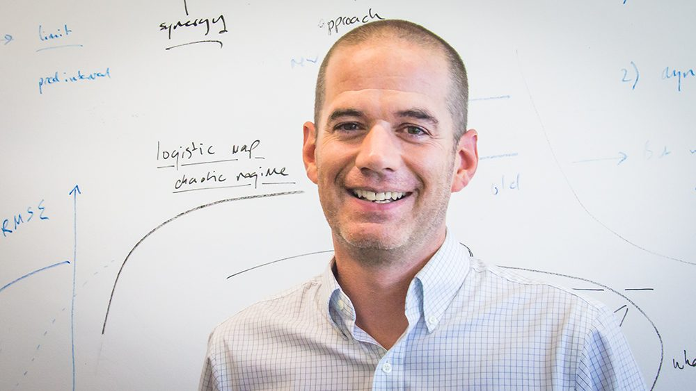

The people who make up the Predictive Ecology Group. Each person controls
their own contact details on their own page — we link out to those rather
than listing email addresses here. For the full, up-to-date roster, see the
[group's page on the IEU website](https://www.ieu.uzh.ch/en/research/ecology/extinction/member.html).

*(This page has one real entry and one placeholder — copy a `.person-card`
block below for each additional current group member.)*

::: {.people-grid}

::: {.person-card}
{.person-photo}

Owen Petchey

Group leader

Owen leads the group's work on ecological forecasting — understanding food
webs and ecological communities well enough to predict how they change.

[Personal page →](https://www.google.com/search?q=owen+petchey+uzh){target="_blank"}

:::

::: {.person-card}
{.person-photo}

Name Surname

Role — e.g. Postdoctoral researcher

*(Short bio placeholder — replace with a sentence or two about this
person's research interests.)*

[Personal page →](#){target="_blank"}

:::

:::

## Alumni

Past members of the group, and where they went next:

- **Chris Clements** — PhD 2011–2014
- **Aurélie Garnier** — PhD 2014–2018; postdoc in Hamburg on spatio-temporal food web dynamics in the Baltic Sea
- **Gian Marco Palamara** — PhD student & postdoc
- **Marco Plebani** — PhD student
- **Thomas Massie** — postdoctoral researcher
- **Michael Pontarp** — postdoctoral fellow
- **Aabir Banerji** — postdoctoral researcher, 2011–2013
- **Aaron Thierry** — PhD 2008–2012, biological network structure; later a postdoc at the School of GeoSciences, Global Change Research Institute, Edinburgh
- **Emily Green (now Emily Griffiths)** — PhD 2009–2013, indirect effects of vaccination programmes; later a postdoc on Dengue transmission at North Carolina State University
- **Oliver Beveridge** — PhD 2006–2010, "Swimming in hot water"; later modelling bird distributions as a postdoc at Durham University
- **Nick Worsfold** — PhD 2004–2008, consequences of extinction in experimental aquatic communities; later academic posts at the University of York, now Lecturer in Environmental Science at the University of Bedfordshire
- **Dan Leary** — PhD 2004–2008, determinants of ecosystem variability in microbial microcosms; later NERC Parliamentary Liaison Officer, then Foresight Project Manager at the UK Government Office for Science
- **Katie Horgan** — PhD student and research assistant
- **Susanne Schulmeister** — Global Change and Biodiversity MOOC co-creator and producer, 2016–2018
- Also: Marcus Cianciaruso, Jason Rip, Edd Hammill, Beth Atkinson, Andrew Cole, Kez Watt, Nick Clark, Mahtab Mohebbi, Emily Oliveira, Gustavo Henrique de Carvalho, Rebecca Stewart, Roger Bachmann, Peter Schmid, Suzanne Greene, Severin Roffler, Marquita Brilliante, Hao Yiqi, Philippe Saner, Ivelina Grozeva, Jason Griffiths, Louis Sutter, Pablo Antiqueira, Dominik Schmid, Mirjam Schärer, Valérian Zeender, Mike Amato, Philipp Dermond, and Cedric Bachmann.
