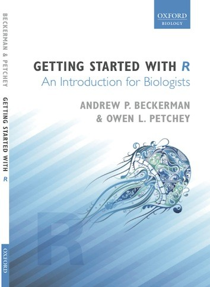
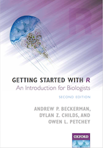

::: {layout-ncol="2"}
{width="300px"}

{width="300px"}
:::

**From the [review of the book in Trends in Ecology and Evolution](http://www.sciencedirect.com/science/article/pii/S0169534712001590), by Graeme D. Ruxton, University of St Andrews:**

- "The book would make the ideal text for a short course on data management and presentation — it truly packs an amazing amount of wisdom and wit between slim covers."
- "This command-line interface is part of what makes R wonderful, but also what can make it intimidating to get started on. Blowing away any feeling of intimidation is what this book is about."
- "A final strength of this book is that it does not try to do too much; its aim is to get you comfortable with R, not to teach you new statistical methodologies."

**Vi Nguyen (Graduate Student):**

> I've honestly got to say that it has been extremely helpful in my reacquaintance with R! I found the conversational and colloquial tone of the manuscript very effective in getting points across to the inexperienced R user (i.e. me). In the past, referring to other R textbooks has left me feeling even more bewildered and confused than I originally was, as they all seem to assume that the inexperienced reader already knows everything there is to know about R, whereas your manuscript explains everything simply from the start.
>
> The explanations of *why* certain commands and steps were done in R were a novel touch — I don't remember any other R textbook explaining why they'd done certain things.
>
> I felt like I had constant help and guidance throughout the whole book, rather than being left alone to figure things out.

**Three anonymous reviewers:**

- "I agree absolutely with the authors' claim that most people want to learn R, and are put off by the steepness of the learning curve. A book that could help people up that curve would be very popular."
- "The book is timely and relevant to a large number of courses being taught."
- "The way that the book is set up is good from the perspective of the things you are probably going to be doing in R... R is very task-oriented."

**Department of Biology, McGill University, Montreal (20–22 April 2009):**

- "I thought the course was excellent and wish I'd started using R five years ago. Thank you!"
- "Very, very helpful. Saved me about a year of my PhD!"

**Andy Hector, Zurich University:**

> A brilliant demonstration of what multivariate methods are good for and how to implement them in R.

**Durham Anthropology and Biology (10–12 March 2008):**

> This is the best course I've been on in the last five years.

**Marco Batalha, Federal University of São Carlos, Brazil (12th Nov 2008):**

> Foi uma grande oportunidade para alunos e professores poderem assistir a esse curso no Brasil. Sua filosofia permite que alguém aprenda o R de maneira intuitiva e perceba as suas muitas poderosas ferramentas. O curso permite que alguém tenha uma transição suave de programas estatísticos orientados por menus para o R.
