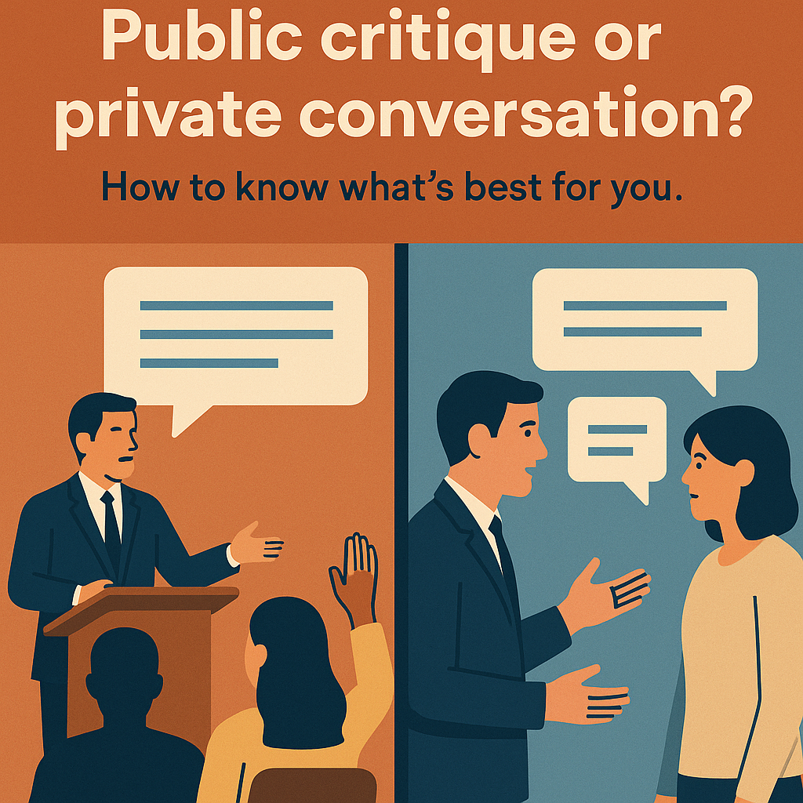

{width="250px"}

A few months ago, I and some colleagues at the University of Zurich gathered to discuss a recent paper in a leading ecology journal. During the discussion, I realised — or at least believed — that the paper contained an error. Depending on how one interpreted the error and the paper's aims, it had the potential to mislead readers, especially students or early-career researchers still developing their understanding.

So, what should I do?

Should I write a formal comment, or post a critique in a public forum? Should I contact the author privately? Or should I do nothing, hoping others might notice and address the issue in their own way?

Which would you choose? It's not an easy decision, especially without knowing the specifics — but many of us have faced similar moments. My point here is simple: you do have a choice, your choice matters, and it's worth making it deliberately and reflectively.

Here's how I approached it, guided by a few principles:

1. I might be wrong.
2. I don't need or want to benefit personally from this.
3. I want to help the community and relationships, not harm them.
4. People should have the chance to address issues themselves.
5. We should foster an environment where it's safe to make and correct mistakes.
6. Researchers should be accountable for what they publish.

Based on these, I decided a public critique — while perhaps justifiable — wasn't the best first step. It could easily have read as confrontational or dismissive of the author's work, and I wanted to avoid an adversarial exchange that might damage relationships or weaken our academic community.

Instead, I wrote to the author directly. I explained my concerns, and after some thoughtful back and forth, we had a productive exchange. The author was receptive, and eventually submitted a correction to the journal.

This experience reinforced a few things for me:

- Approach with humility and curiosity — I might be wrong, and listening matters.
- Private dialogue can work: it allows for nuance, mutual understanding, and a constructive outcome.
- Tone matters — I tried to centre the discussion on reasoning, not critique of the author.
- Expect defensiveness. Criticism, even of a small part of a paper, can feel personal.
- Expect misunderstanding, especially over email, where intentions and points can be misread.
- Stay focused. If the author raises tangential concerns, acknowledge them but gently steer the conversation back.
- Give space. Waiting a few days between responses can help keep things thoughtful rather than reactive.

Still, I have mixed feelings. I'm not sure the correction was sufficient, or that it will be noticed — it's a small change in a large and growing body of literature, and many readers may never see it. That's a common problem with post-publication corrections: important, but often invisible. I also don't know whether a public comment would have reached more people, or been remembered for longer.

I'm in a fortunate position — I have long-term job security, and don't feel a personal need to raise my profile. That wasn't always the case; earlier in my career I engaged in more public back-and-forths, and may even have enjoyed them. But over time I've come to believe that public critiques, though sometimes necessary, often generate more heat than light. They can create a culture of defensiveness and fear rather than one of inquiry and humility.

Not always, though — I admire those who manage public critique with grace and generosity.

For me, the key realisation is this: how we critique each other's work is just as important as the critique itself. Our choices shape the culture of our field — whether we cultivate curiosity and respect, or suspicion and hostility.

Have you faced a similar decision? How did you handle it? I'd be very interested to hear your thoughts.
