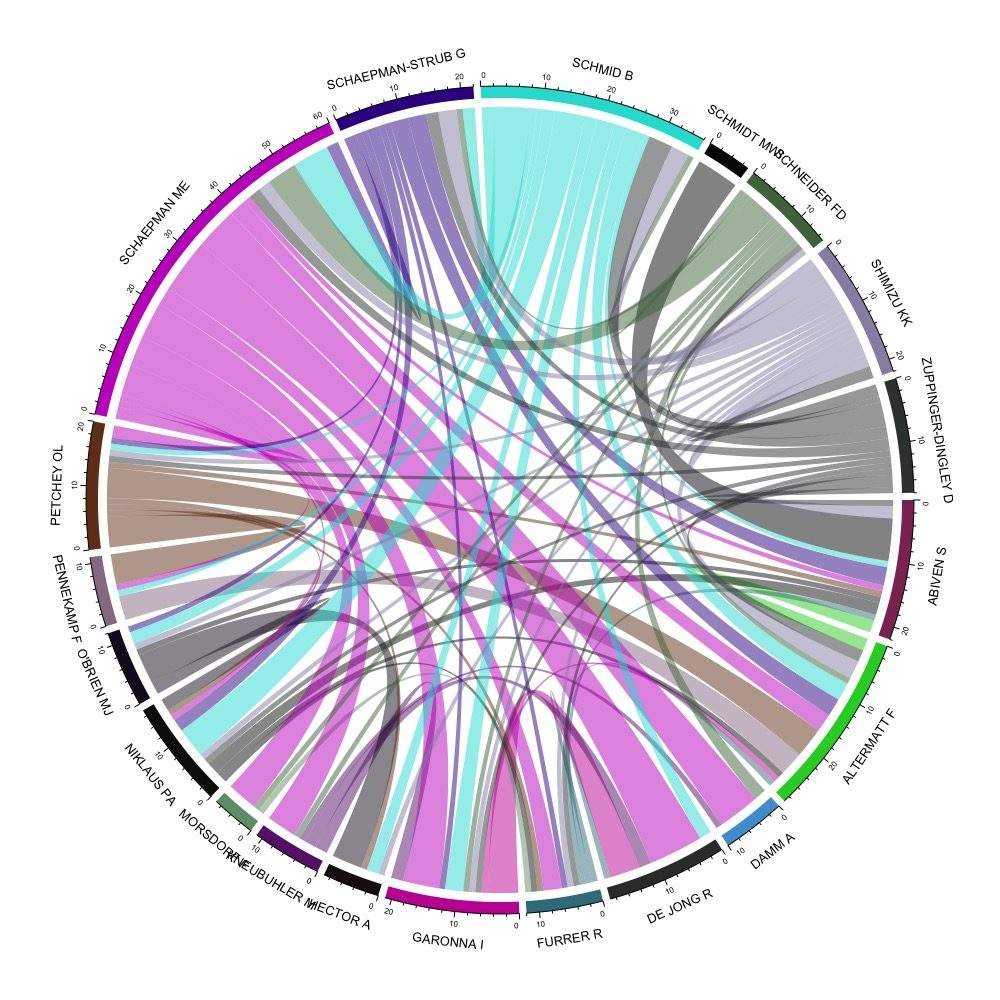
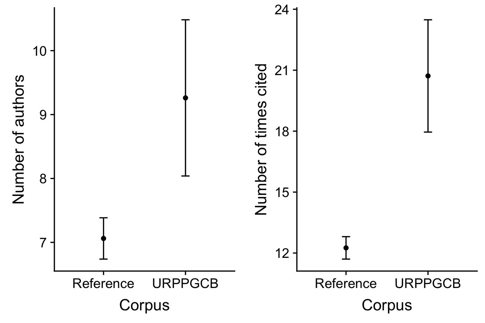

Do you think *integrative* research has *added value* — that it's more than the sum of its parts? How can we show how integrative a body of research is, and investigate whether it has added value?

These are difficult questions we don't have all the answers to. Here we give a few possibilities, based on the corpus of publications produced by a research programme aimed at creating added value by promoting integrative research. We visualise characteristics of that corpus and compare it to a reference corpus of publications from research that may or may not have been integrative. (The details of how we did this are below, for anyone who wants to try something similar.)

The example involves the corpus of publications arising from the [University of Zurich Research Priority Programme in Global Change and Biodiversity (URPP GCB)](https://www.gcb.uzh.ch/en.html). The reference corpus is from related research fields at the University of Zurich over a similar time period (exact specification in the details section below).



This figure shows the tightly connected co-authorship network of 20 of the researchers in the URPP GCB — a great deal of integration in terms of collaboration. The number of co-authors per article in the URPP GCB corpus is about 20% greater than in the reference corpus, though only by around one author on average, and articles are cited about 30% more often (figure below).



# The gory details

What follows is fairly technical, and assumes some familiarity with R/RStudio and a handful of add-on packages. The code chunks are shown for reference — they call external files and desktop paths from the original analysis, so they're marked `eval: false` here rather than run at render time. The code and datasets are available in [this GitHub folder](https://github.com/opetchey/dumping_ground/tree/master/corpus_comparison).

## Assemble your focal corpus

We manually entered all publications produced by the [URPP GCB](https://www.gcb.uzh.ch/en.html) into [Zotero](https://www.zotero.org/) (using Zotero's *Add items by identifier* button, adding by DOI).

## Get information about your corpus from Web of Science

```{r}
#| eval: false
## install the following if required
library(bibliometrix)
library(tidyverse)
library(circlize)
library(wordcloud2)
library(cowplot)
```

1. Highlight the papers in Zotero that make up your corpus.
2. Use *File → Export Library...* in Zotero, choose the BibTeX format, leave the boxes unchecked, leave the character encoding as Unicode (UTF-8), and save (we used `from_zotero.bib`).
3. Use the following code to build the search text to paste into the Web of Science (WoS) search field:

```{r}
#| eval: false
readFiles("~/Desktop/from_zotero.bib") %>%
  isibib2df() %>%
  dplyr::mutate(DOI = stringr::str_trim(DI)) %>%
  filter(!is.na(DOI)) %>%
  pull(DOI) %>%
  paste(collapse = " OR ") %>%
  cat(file = "~/Desktop/dois_for_WoS.txt")
```

4. Paste the resulting DOI text into the search field of WoS Basic Search, with `DOI` selected as the field being searched, and hit search.
5. Expect to get fewer results than DOIs entered — at the time of writing we had 164 DOIs, of which WoS found 138.
6. Export the results using *Save to Other File Formats*, with Record Content set to *Full Record and Cited References* and File Format set to BibTeX (WoS caps this at 500 records per export, so large corpora may need several exports).

## Get information about the reference corpus

We built the reference corpus from WoS using:

- Organisation: University of Zurich
- WoS categories: Environmental Sciences, Remote Sensing, Ecology, Plant Sciences, Physical Geography, Environmental Studies
- Timespan: 2013–2018
- Indexes: SCI-EXPANDED, SSCI, A&HCI, CPCI-S, CPCI-SSH, BKCI-S, BKCI-SSH, ESCI, CCR-EXPANDED, IC

This search returned over 2,000 papers, exported the same way as above (across several files, due to WoS's 500-record export limit).

## Load everything into R

```{r}
#| eval: false
focal_corpus <- readFiles("~/Desktop/focal_corpus_from_WoS.bib") %>%
  isibib2df() %>%
  mutate(TC = as.numeric(TC),
         Corpus = "URPPGCB",
         AUx = gsub(";", "", AU),
         num_authors = nchar(AU) - nchar(AUx))

D1 <- readFiles("~/Desktop/ref-corpus1.bib") %>% isibib2df()
D2 <- readFiles("~/Desktop/ref-corpus2.bib") %>% isibib2df()
D3 <- readFiles("~/Desktop/ref-corpus3.bib") %>% isibib2df()
D4 <- readFiles("~/Desktop/ref-corpus4.bib") %>% isibib2df()
D5 <- readFiles("~/Desktop/ref-corpus5.bib") %>% isibib2df()

reference_corpus <- rbind(D1, D2, D3, D4, D5) %>%
  mutate(TC = as.numeric(TC),
         Corpus = "Reference",
         AUx = gsub(";", "", AU),
         num_authors = nchar(AU) - nchar(AUx))
rm(D1, D2, D3, D4, D5)
```

## Make a co-authorship network (focal corpus)

```{r}
#| eval: false
focal_corpus_biban <- biblioAnalysis(focal_corpus)
NetMatrix <- biblioNetwork(focal_corpus, analysis = "collaboration", network = "authors", sep = ";")
MM <- as(NetMatrix, "matrix")
MM <- MM[order(rownames(MM)), order(colnames(MM))]
diag(MM) <- 0
top_authors <- focal_corpus_biban$Authors[1:20]
these_cols <- colnames(MM) %in% names(top_authors)
these_rows <- rownames(MM) %in% names(top_authors)
top_MM <- MM[these_rows, these_cols]
set.seed(999)
chordDiagram(top_MM, symmetric = TRUE)
```

## Combine and compare the focal and reference corpora

```{r}
#| eval: false
reference_corpus <- select(reference_corpus, intersect(names(reference_corpus), names(focal_corpus)))
focal_corpus <- select(focal_corpus, intersect(names(reference_corpus), names(focal_corpus)))
corpus <- rbind(focal_corpus, reference_corpus)

summ_stats <- group_by(corpus, Corpus) %>%
  summarise(mean_cites = mean(TC),
            sem_cites = sd(TC) / sqrt(n()),
            mean_num_authors = mean(num_authors),
            sem_num_authors = sd(num_authors) / sqrt(n()))

p1 <- ggplot(summ_stats) +
  geom_point(mapping = aes(x = Corpus, y = mean_cites)) +
  geom_errorbar(mapping = aes(x = Corpus,
                               ymin = mean_cites - sem_cites,
                               ymax = mean_cites + sem_cites),
                width = 0.1) +
  ylab("Number of times cited")

p2 <- ggplot(summ_stats) +
  geom_point(mapping = aes(x = Corpus, y = mean_num_authors)) +
  geom_errorbar(mapping = aes(x = Corpus,
                               ymin = mean_num_authors - sem_num_authors,
                               ymax = mean_num_authors + sem_num_authors),
                width = 0.1) +
  ylab("Number of authors")

plot_grid(p2, p1)
```
