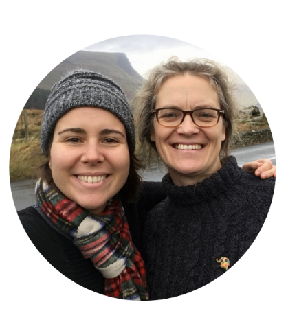
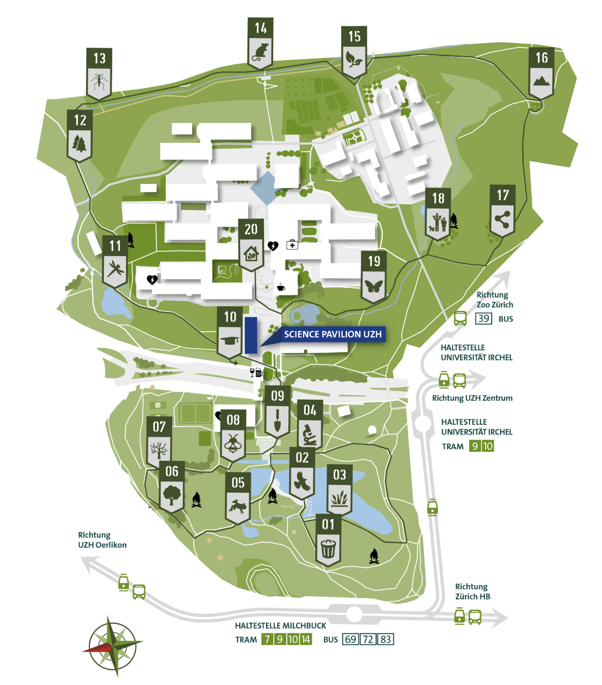

The [Irchel Nature Trail](https://www.sciencelab.uzh.ch/de/andere-angebote/irchel-natur/ueber.html){target="_blank"} started as an idea from two then-PhD students in the group, Alejandra Parreño and Katie Horgan, submitted to the Faculty of Science's "Make Irchel Greener" competition. It grew into a 3-kilometre, 20-station trail through the Irchel Campus, opened on 22 May — the International Day for Biological Diversity — with Dr Morana Mihaljević of UZH Science Lab as project manager.

::: {layout-ncol="2"}
{width="260px"}

{width="260px"}
:::

Each of the 20 stations focuses on something easy to walk straight past — birds and lake wildlife, amphibians in the ponds, microorganisms living in the streams, the relationships between trees and fungi, wetland habitats, the surprising amount of life in dead wood, mammals like foxes and badgers, insects from bees and dragonflies to butterflies and moths, the campus's geology, and the hill's own ecology — alongside stops on UZH's own research. Quiz questions for children, DIY tips, and QR codes linking to further UZH research and events are built into the stations along the way.

The project was backed by the Faculty of Science, the Science Lab, the URPP Global Change and Biodiversity, the MNF Sustainability Committee, and the SNSF Agora project behind [*Biodiversity means Life*](https://www.gcb.uzh.ch/en/Agora.html){target="_blank"} — the same public-engagement effort behind [an earlier post here](../2017-06-01-biodiversity-means-life/index.qmd). As Alejandra put it: "What started as a simple idea has now led to a transfer of knowledge between UZH and the public."

Here's a short video about the trail:

```{=html}
<div style="max-width: 560px; margin: 1.5rem auto;">
<iframe width="560" height="315" src="https://www.youtube.com/embed/p3zOC_tjKQE?si=9PxO8qcWuwKDP85d" title="YouTube video player" frameborder="0" allow="accelerometer; autoplay; clipboard-write; encrypted-media; gyroscope; picture-in-picture; web-share" referrerpolicy="strict-origin-when-cross-origin" allowfullscreen style="width: 100%; aspect-ratio: 560 / 315; height: auto;"></iframe>
</div>
```
