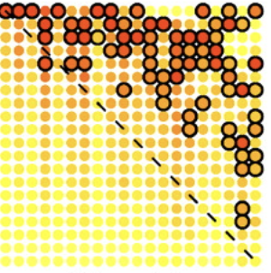

## Predicting the architecture of food webs

Ecologists have spent decades drawing food webs: maps of who eats whom in an ecosystem. But a much harder question lies behind those maps. Could we predict the food web before observing all of its feeding interactions? And, if we could, might the same principles allow us to predict how the web will reorganise when the environment warms or species disappear?

Decades of work have shown that the architecture of food webs is not random, but rather emerges from the biological and ecological processes that govern the behaviour of individual species. Models such as the cascade model pioneered by Joel Cohen (Cohen, 1984), the niche model of Martinez and Williams (Martinez & Williams, 2004) and the nested hierarchy model of Cattin and colleagues (Cattin et al., 2009) have shown that simple rules can generate food webs resembling those observed in nature.

Common to all those models, however, is they need the number of feeding links as inputs. They can predict the identity of the links, but only after being told how many there are. That is a serious limitation if we want to predict food web structure and dynamics in a changing world. The requirement for already knowing the number of links could even mean we need to know the food web before we can predict it.

A sustained body of work involving Owen Petchey, Andrew Beckerman and Phil Warren, together with numerous collaborators, has pursued exactly this goal. Its distinctive feature has been an attempt to move food-web ecology away from describing network patterns and towards explaining them from the biology of the organisms involved. Two deceptively simple ideas sit at its heart: consumers should choose food in ways that make energetic sense, and organismal body size places constraints on what is physically and energetically possible.

Those ideas eventually produced the Allometric Diet Breadth Model (ADBM)—a mechanistic model linking body size, optimal foraging and the architecture of entire food webs. The resulting research programme has subsequently expanded to questions about extinction, climate warming, uncertainty and the amount of empirical information we actually need to reconstruct a food web.

{fig-align="center" width="350"}

## The first problem: why are food webs as connected as they are?

One of the fundamental properties of a food web is its connectance: the fraction of all possible feeding links that actually occur. A community could, in principle, contain an enormous number of predator–prey interactions. Real communities contain only a subset.

Early food-web models were often phenomenological. They could generate networks resembling those found in nature by imposing relatively simple statistical rules. The work of Beckerman, Petchey and Warren (Beckerman et al. 2006) instead asked whether food-web complexity could emerge from something much closer to the decisions made by individual animals: what should a consumer eat?

Their approach drew on optimal-foraging theory. A predator encounters potential prey that differ in energetic value and in the time required to capture and process them. Adding every possible prey species to the diet is therefore not necessarily advantageous. Consumers should include prey when doing so increases their overall rate of energetic gain.

To predict the diet of a consumer, and then of all consumers, Beckerman, Petchey and Warren used a simple mathematical framework. They calculated the number of prey species that should enter a consumer’s diet given the energetic value of each prey, the time required to capture and process it (handling time), and the frequency with which a predator encounters a prey type (which is the rate at which the consumer searches multipled by the prey abundance). This information allows calculation of the number of prey that maximises the rate at which a consumer can gain energy. This is diet breadth. Doing this for each and every consumer and then adding up the diet breadths gives the total number of feeding links in the food web.

It is important to note that this diet breadth model can predict that either all consumers eat only one prey, or that all consumers eat all prey, or anything in between. The model does not assume a particular level of connectance. It predicts it from the underlying biology. It can predict the minimum connectance of 1 / number of species, the maximum connectance of 1, or anything in between. Observed food webs do, indeed, have a connectance somewhere in between those extremes (often around 0.3 or 0.4)

But does it work? Does the diet breadth model predict well the observed number of links (connectance) in food webs. Remarkable, when parameterised with completely independent data (e.g., on handling times, attack rates and energetic values), the model predicted the number of links in 15 out of 16 empirical food webs within a factor of two. That is a strikingly good result for a model that does not use any information about the observed network itself.

This was an important conceptual shift. Instead of saying, in effect, food webs have approximately this many links because empirical food webs tend to have this many links, it became possible to ask whether their complexity could emerge from biological mechanisms. Andrew, Owen, and Phil believe this was the first time anyone had shown that the number of links in a food web could be predicted from the biology of the organisms involved.

## From predicting how many links to predicting structure

Predicting connectance is one thing. Predicting the identity of the links is considerably more demanding.

That was the challenge addressed by the development of the Allometric Diet Breadth Model (Petchey et al. 2008). The ADBM combines diet breadth model with allometric relationships between body size and the parameters governing feeding. Given information about the body sizes of the organisms in a community, it ranks potential resources according to their profitability and predicts which should enter each consumer’s diet.

The result is remarkable in principle: relatively simple measurements of organisms can be converted into predictions about the architecture of an ecological network.

The approach therefore provides a bridge across biological scales. Body size is a property of an organism. Search rate, handling time, abundance, and energetic value describe interactions between organisms. Diet breadth is a property of a consumer. Connectance and food-web topology are properties of an entire ecological community. The ADBM links those levels through a common mechanistic argument based on foraging.

And it worked. The ADBM predicted the identity of feeding links in 15 out of 16 empirical food webs better than random networks, and in 10 of those cases better than a simpler model that did not use body size (Petchey et al., 2008).

The model was not, of course, perfect. An independent evaluation found that the ADBM predicted substantially more trophic links correctly than random networks, but also showed that simpler models could sometimes perform as well or better, highlighting the need to test whether the additional biological mechanisms genuinely improve prediction (Allesina, 2009).

That criticism spurred subsequent work that used the ADBM in ways that would have been been very challenging for simpler models.

## Body size as the basis of food webs

This emphasis on body size was part of a wider transformation in food-web ecology in which Guy Woodward and collaborators played a major role. Woodward and colleagues argued that body size condenses an extraordinary amount of ecological information. Size influences metabolism, abundance, movement, feeding rates and the range of prey an organism can consume. Consequently, incorporating size into ecological networks provides a way to connect their structure to energetic fluxes, stability and responses to environmental perturbation (Woodward et al., 2005).

Indeed, analyses of empirical food webs have shown that body size is often a better predictor of feeding interactions than taxonomy (Woodward et al., 2010). An extension of the Allometric Diet Breadth Model predicted the structure of empirical food webs almost twice as accurately as the equivalent species-based webs, with the best-fitting model predicting 83% of the links correctly in the Broadstone Stream size-based web. The few mismatches between the model and data were explained largely by sampling effects.

## And add temperature

Climate warming makes the prediction problem harder again because temperature can alter interactions even when the list of species remains unchanged. Petchey, Ulrich Brose and Björn Rall tackled this problem by adding temperature dependence to the foraging machinery underlying food-web structure. Using Arrhenius relationships to describe the temperature sensitivity of feeding traits, they asked how warming should alter food-web connectance (Petchey et al., 2010).

The answer was not simply “warming increases connectance” or “warming decreases connectance.” Instead, the direction of change depends on the relative temperature sensitivities of processes such as attack rate and handling time. The model predicted effects ranging from very weak responses to changes equivalent to roughly one prey item entering or leaving a consumer’s diet for every 2°C of warming in particularly temperature-sensitive webs (Petchey et al., 2010).

Even more interestingly, different food webs were predicted to respond differently partly because they contained different body-size distributions. Temperature and size therefore cannot always be treated as separate ecological drivers: temperature changes biological rates, while the sizes of the organisms determine how those altered rates translate into interactions.

## Iceland: nature's warming experiment

Iceland provides an extraordinary natural laboratory for studying climate change. Geothermal activity creates neighbouring streams that are broadly similar in many respects but differ substantially in temperature. Instead of experimentally heating a tiny artificial ecosystem for a few weeks, ecologists can study naturally warmed communities that have experienced different thermal environments over much longer periods.

Working with Eoin O’Gorman, Guy Woodward and a larger team, Petchey helped connect these Icelandic systems to the ADBM framework.

The scale of the empirical effort was formidable: approximately 50,000 directly observed feeding interactions across 14 naturally heated streams. The warmer food webs were simpler, with shorter pathways transferring energy from resources through consumers. Yet a relatively simple allometric diet-breadth framework predicted approximately 68–82% of the observed feeding interactions, as well as important effects of warming on food-web properties (O’Gorman et al., 2019).

Perhaps the most important result was why warming simplified the webs. Model simulations pointed towards changes in the relative diversity and abundance of consumers and resources. Warming did not merely turn individual links on and off independently. It altered the biological ingredients from which the network was assembled, and the structure of the web changed as a consequence (O’Gorman et al., 2019).

That is an important development of the original ADBM idea. A model devised to explain who eats whom becomes a framework for asking how environmental change reorganises an entire network.

## How much data do we actually need?

There is another practical reason predictive food-web models matter: observing feeding interactions takes time, effort, and resources. And some are very rare and difficult to observe.

A gold standard method for observing a feeding interaction is to examine the gut contents of a predator and identify the prey items it has consumed. Constructing a detailed food web may require examining the gut contents of hundreds or thousands of predators. If body size and a relatively small sample of observed diets can parameterise a model that accurately reconstructs the rest of the network, the saving in field and laboratory effort could be substantial.

Gupta, Figueroa, O’Gorman, Jones, Woodward and Petchey tested precisely this possibility using seven unusually well-characterised food webs. They repeatedly reduced the number of predator guts used to parameterise the ADBM and asked how much information was actually necessary. In some cases, accurate network prediction was possible with only 27% of the available gut samples (Gupta et al., 2022). This turns the ADBM into more than an explanatory theory. It becomes a potential sampling tool: collect enough observations to constrain the model, then use biological theory to infer interactions that have not been directly observed.

## Putting uncertainty into the prediction

There is, however, an important danger in any deterministic food-web reconstruction: a predicted link can look deceptively certain. More recent work by Anubhav Gupta, Reinhard Furrer and Owen Petchey addressed this by fitting the ADBM using approximate Bayesian computation. Instead of producing only one "best" set of model parameters and therefore one predicted network, the approach estimates distributions of plausible parameters and carries that uncertainty through into predictions of food-web structure (Gupta et al., 2022).

Importantly, this version simultaneously considers the presence and absence of links, allowing connectance itself to emerge from model fitting. Across 12 food webs, predicted connectance was higher than in the observed networks, while uncertainty in parameters sometimes translated into considerable uncertainty about network structure (Gupta et al., 2022).

There are at least two interpretations of mismatches between predicted and observed links. The model may predict interactions that are biologically possible but prevented by traits it does not include. Alternatively, empirical food webs may themselves be incomplete: a predator may genuinely eat a prey species even though researchers failed to observe that interaction. Gupta and colleagues explicitly suggest that both processes probably occur (Gupta et al., 2022).

That is an unusually productive kind of model failure. A disagreement between model and data becomes a hypothesis: is this link biologically impossible, or have we simply not looked hard enough?

## From maps to mechanisms

Seen together, this body of work tells a coherent story about how food-web ecology has changed.

The starting point was a network statistic: how connected is a food web? Beckerman, Petchey and Warren’s work helped reframe that question mechanistically, asking whether complexity could emerge from the economics of foraging. The ADBM then pushed the idea further, from predicting the number of interactions towards predicting their identity. Body-size approaches associated with Petchey, Woodward and the wider food-web community supplied a common currency connecting organisms, interactions and ecosystem structure (Woodward et al., 2005).

The same framework naturally leads to perturbations. Remove species and the opportunities available to consumers change; cascading extinctions can preferentially eliminate unusual trophic roles (Petchey et al., 2008). Change temperature and the rates governing foraging change, potentially altering diet breadth and connectance (Petchey et al., 2010). Test those ideas against naturally warmed Icelandic streams and a striking amount of observed network structure—and its response to warming—can be recovered from a comparatively simple model (O’Gorman et al., 2019).

None of this means that body size and optimal foraging provide a complete theory of ecological networks. They clearly do not. Independent tests have identified interactions the ADBM misses and cases in which simpler models perform competitively (Allesina, 2009), while subsequent research has reinforced the importance of traits beyond size.

The achievement of this research programme is to demonstrate that surprisingly complicated ecological networks can be approached from a small number of measurable biological mechanisms. Body size tells us something about what an organism can eat. Foraging theory tells us something about what it should eat. Temperature changes the costs and benefits involved. Species loss changes the menu itself. From those ingredients emerge changes in diets, interactions, connectance and eventually the architecture of the whole ecosystem. That is the larger promise of mechanistic food-web ecology: not simply to draw increasingly detailed maps of nature, but to understand the rules well enough that, when the world changes, we can begin to predict how those maps will be redrawn.

## References

Allesina, S. (2009/2010). Predicting trophic relations in ecological networks: a test of the Allometric Diet Breadth Model. Journal of Theoretical Biology. (Paper)

Beckerman, A., Petchey, O. L., & Morin, P. (2010). Adaptive foragers and community ecology: linking individuals to communities and ecosystems. Functional Ecology, 24, 1–6. (Paper)

Brose, U. (2010). Body-mass constraints on foraging behaviour determine population and food-web dynamics. Functional Ecology, 24, 28–34. (Paper)

Brose, U., et al. (2017). Predicting the consequences of species loss using size-structured biodiversity approaches. Biological Reviews, 92. (Paper)

Gupta, A., Figueroa, H. D., O’Gorman, E., Jones, I., Woodward, G., & Petchey, O. L. (2022). How many predator guts are required to predict trophic interactions? Food Webs. (Paper)

Gupta, A., Furrer, R., & Petchey, O. L. (2022). Simultaneously estimating food web connectance and structure with uncertainty. Ecology and Evolution, 12. (Paper)

O’Gorman, E., Petchey, O. L., Faulkner, K. J., Gallo, B., Gordon, T. A. C., Neto-Cerejeira, J., Ólafsson, J., Pichler, D. E., Thompson, M., & Woodward, G. (2019). A simple model predicts how warming simplifies wild food webs. Nature Climate Change, 9, 611–616. (Paper)

Petchey, O. L., Eklöf, A., Borrvall, C., & Ebenman, B. (2008). Trophically unique species are vulnerable to cascading extinction. The American Naturalist, 171, 568–579. (Paper)

Petchey, O. L., Brose, U., & Rall, B. C. (2010). Predicting the effects of temperature on food web connectance. Philosophical Transactions of the Royal Society B, 365, 2081–2091. (Paper)

Petchey, O. L., & Belgrano, A. (2010). Body-size distributions and size-spectra: universal indicators of ecological status? Biology Letters, 6, 434–437. (Paper)

Thompson, R., Dunne, J., & Woodward, G. (2012). Freshwater food webs: towards a more fundamental understanding of biodiversity and community dynamics. Freshwater Biology, 57, 1329–1341. (Paper)

Woodward, G., Ebenman, B., Emmerson, M., Montoya, J., Olesen, J., Valido, A., & Warren, P. (2005). Body size in ecological networks. Trends in Ecology & Evolution, 20, 402–409. (Paper)

Woodward, G., Blanchard, J., Lauridsen, R.B., Edwards, F.K., Jones, J.I., Figueroa, D., et al. (2010). Individual-based food webs: species identity, body size and sampling effects. Advances in Ecological Research, 43, 211–266.

